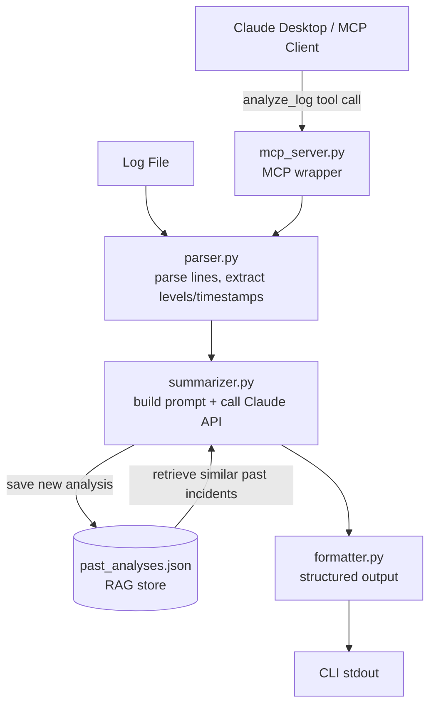

# LogLens — Architecture Proposal

## Overview

LogLens is a CLI tool that ingests a generic log file (`timestamp level message` format) and returns a structured summary: errors, warnings, time range, occurrence counts, and AI-inferred root cause.

Two architectural patterns power the system: **RAG** for context-aware analysis and **MCP** to expose LogLens as a callable tool for any Claude client.

---

## System Diagram



---

## Pattern 1 — RAG

### Why it fits
LogLens sees repeated error patterns across runs. RAG lets Claude say "this looks like the DB timeout cluster from last Tuesday" instead of treating every log as a fresh problem.

### What it connects to
A local `past_analyses.json` file storing previous summaries keyed by dominant error pattern. At query time, `summarizer.py` reads this file, finds the closest matching past entry (string match on error type), and injects it into Claude's context window before asking for root cause.

No vector DB. No embeddings. Just structured JSON + context injection.

### Risk / limitation
String matching is brittle — two different phrasings of the same error won't link. A real system would use embeddings. For this project, the tradeoff is acceptable: simpler code, faster demo, same observable behavior on controlled sample logs.

---

## Pattern 2 — MCP

### Why it fits
MCP lets LogLens become a tool any Claude client can invoke. Instead of running the CLI manually, Claude Desktop can call `analyze_log` inline while a user is already in a conversation — no context switching.

### What it connects to
An MCP server (`mcp_server.py`) wraps the existing `parser → summarizer → formatter` pipeline and exposes one tool: `analyze_log(filepath: str) -> str`. The server runs locally; Claude Desktop connects via stdio transport.

### Risk / limitation
MCP server must stay running in the background during a session. Startup friction is higher than a plain CLI. For demo purposes this is fine; in production you'd want it as a persistent background service.

---

## Data Flow Summary

```
log file
  → parser.py        (extract structured events)
  → summarizer.py    (RAG lookup + Claude API call)
  → formatter.py     (render structured output)
  → stdout / MCP response
```

Past analyses persist to `past_analyses.json` after each run, growing the RAG store over time.
